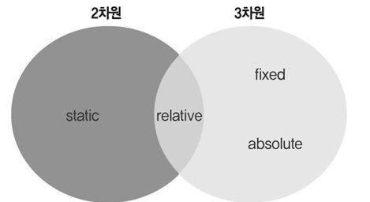

# HTML

- HTML 문서의 기본 구조

---
> ## p >태그 <br>
> < p >태그는 paragraph의 약자로 단락을 표현할 때 사용합니다. 신문 기사로 치면 본문 영역에 해당합니다. 웹 사이트의 주요 텍스트 정보 대부분에는 < p > 태그를 사용 

> ## < span > 태그<br> 
>< span > 태그는 문단 안에 있는 특정 단어나 문장에 디자인을 지정할 때 사용합니다. 
< span > 태그는 눈에 띄는 특징이 없으며 보통 디자인 작업을 담당하는 CSS 언어와 함께 사용 
< span style = "color: red;">Hyosun Kim< /span > 

>## < mark > 태그<br>  
>< mark >태그는 국어사전처럼 단어나 개념을 설명하는 문장이나 인용된 문장에서 특정 텍스트를 강조할 때 사용 
<mark> 태그의 기본값인 노란 배경색을 바꾸고 싶다면 다음과 같이 CSS 언어를 사용하여 수정합니다. 
< mark style=“background-color: red;” >사과< /mark > 
 
 >## < ol >, < ul >, < li > 태그<br> 
 >< ol > 태그는 ordered list(순서가 있는 목록)의 약자로 숫자나 알파벳 등 순서가 있는 목록을 만들 때 사용합니다. < ul > 태그는 unordered list(순서가 없는 목록)의 약자로 순서가 없는 목록을 만들 때 사용합니다. 보통 메뉴 버튼이나 제품 목록 등을 만들 때는 < ul > 태그를 사용합니다. < ol > 태그와 < ul > 태그의 각 항목을 나열할 때는 list item의 약자인 < li > 태그를 사용합니다. 

 >## < br > 태그 <br>
>< br > 태그는 line break를 뜻하며 강제로 줄 바꿈을 할 때 사용합니다. 줄 바꿈을 할 위치에 < br > 태그를 입력하면 바로 다음 항목부터 줄이 바뀝니다. 

>## < nav > 태그<br> 
>< nav > 태그는 메뉴 버튼을 담는 공간입니다. < nav > 태그 안에는 버튼을 만들 때 사용하는 < ul >, < li >, < a > 태그를 입력할 수 있습니다. 

>## < aside > 태그<br> 
>< aside > 태그는 웹 사이트의 왼쪽 또는 오른쪽 가장자리에 정보를 담는 공간입니다. 흔히 사이드 바라고 부르는 공간입니다. 보통은 배너나 관련 상품처럼 웹 사이트 본문 내용과 직접적으로 관련이 적은 내용을 담습니다.

>## < main > 태그<br> 
>< main > 태그는 웹 사이트의 본문 내용 전체를 감쌀 때 사용합니다. 따라서 HTML 문서 한 개당 한 번밖에 사용할 수 없습니다.  

>## 인터널 방식<br> 
>인터널 방식은 < head > 태그 안에 < style > 태그를 사용하여 CSS를 적용하는 방식입니다. 다음과 같이 < style > 태그 안에 디자인을 적용할 영역인 < h1 > 태그를 선택한 다음 color: red;을 입력하면 < h1 > 요소인 Hello World에 빨간색이 적용되어 브라우저 화면에 출력됩니다.

```HTML 
<head> 
    <title>웹 프로그래밍 기초</title> 
    <!-- 주석 // 인터널 방식 : <head> 태그 안에 <style> 태그를 추가하여 디자인하는 방식 --> 
    <style> 
        h1{ 
            color: red; 
        } 
    </style> 
</head> 
```
  
>## 인라인 방식<br> 
>인라인 방식은 HTML 태그에 직접 style 속성을 추가하여 적용하는 방식입니다. < h1 > 태그 안에 style 속성을 추가하여 "background-color: yellow;"를 입력하면 노란색 배경이 적용됩니다.
```HTML 
<body>  
<h1 style = "background-color: yellow;">hello world</h1> 
</body 
```
 
>## 익스터널방식<br> 
>Css파일을 만들어서 html과 연동<br> 
>< head >태그 안에 < link >태그 작성<br> 
>< link rel = "stylesheet" href = "style.css" > 

>## type 선택자<br>  
>type 선택자는 < h1 >, < p >, < a >, < span > 같은 HTML 태그를 기준으로 디자인을 적용 

  
>## id 선택자<br>  
>id 선택자는 HTML 태그에 ‘이름’을 지어 선택하는 방식입니다. 다음과 같이 원하는 태그에 id 속성을 추가하고 속성값에 자신이 원하는 이름을 적어 줍니다.  

  
>## class 선택자<br>  
>class 선택자는 HTML 태그에 ‘별명’을 지어 선택하는 방식입니다. id 선택자와 마찬가지로 원하는 태그에 class 속성을 추가하고, 속성값에 원하는 별명을 작성 

>## margin 속성<br> 
>margin 속성은 border 속성을 기준으로 바깥쪽 영역을 의미합니다. 배치 작업에서 좌표를 설정할 때 사용합니다. margin 속성의 종류에는 margin-top(상단 여백), margin-right(오른쪽 여백), margin-bottom(하단 여백), margin-left(왼쪽 여백)가 있습니다. 
<br>margin: 40px 30px 20px 10px; 



>## 3차원의 세계, absolute<br> 
>absolute 속성값은 <br>➊ 부모 자식 간에 발생하는 마진 병합 현상X
<br>➋ top·right·bottom·left 속성이 적용. 
<br>< div id="box1" >< /div >  
<br>< div id="position_absolute_parent" >  
<br>< div id="position_absolute_child" >< /div > < /div > 
```html
transform:rotate(45deg);  
transform:scale(2, 2); 
transform: skew(10deg, 20deg); 
transform:translate(100px, 200px); 
#transition:hover{ width: 600px; } 
```
```html
#transition { width: 300px; height: 300px; background-color: yellow; 
 transition-property: width; transition-duration: 3s; 
 transition-timing-function: ease; 
#transition:hover { width: 600px; }
```
 
---
##
###
``` HTML
<!DOCTYPE html>     
<html>              
<head>              
<meta charset="UTF-8">                           
<meta name="description" content="Web Tutorial">
<meta name="keywords" content="HTML, CSS">
<meta name="author" content="HYOSUN">
    <title>웹 프로그래밍 기초</title>                
</head>
<body>                                               
</body>
</html>
```

