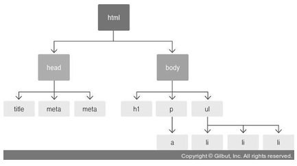

# 리액트 

- 리액트 이해

---
> ## 리액트의 이해
> 리액트는 자바스크립트 라이브러리로 사용자 인터페이스를 만드는 데 사용합니다. 구조가 MVC, MVW 등인 프레임워크와 달리, 오직 V(View)만 신경 쓰는 라이브러리.


> ## JSX란?
> 자바스크립트의 확장 문법
```JSX
function App() {
  return (
    <div>
      Hello <b>react</b>
    </div>
  );
}
▼▼▼▼▼▼▼▼▼▼▼▼▼▼▼▼▼▼▼▼▼▼▼▼▼▼▼▼▼▼▼▼▼▼▼▼▼▼▼▼▼▼▼▼▼▼▼▼▼▼▼▼▼▼▼▼▼▼▼▼▼▼▼▼
function App() {
return React.createElement("div", null, "Hello ", React.createElement("b", null, "react"));
}
```

> ## ReactDOM.render  
컴포넌트를 페이지에 렌더링하는 역할을 하며, react-dom 모듈을 불러와 사용

> ## 리액트_감싸주기
```js
import React from 'react';
function App() {
  return (
    <div> /**Fragment대체가능**/
      <h1>리액트 안녕!</h1>
      <h2>잘 작동하니?</h2>
    </div>
  );
}
export default App;
▼▼▼▼▼▼▼▼▼▼▼▼▼▼▼▼▼▼▼▼▼▼▼▼▼▼▼▼▼▼▼▼▼▼▼▼▼▼▼▼▼▼▼▼▼▼▼▼▼▼▼▼▼▼▼▼▼▼▼▼▼▼▼▼
import React from 'react';
function App() {
  return (
    <>
      <h1>리액트 안녕!</h1>
      <h2>잘 작동하니?</h2>
    </>
  );
}
export default App;
```
> ## 리액트_자바스크립트 표현
```js
import React from 'react';
function App() {
    const name = '리액트';
    return(
        <>
        <h1>{name} 안녕!</h1>
        <h2>잘 작동하니?</h2?>
        </>
    );
}
export default App;     

{/* 결과: 리액트 안녕!<br> 잘 작동하니?*/}

```
> ## if문 대신 조건부 연산자(삼항연산자)
```js
function App() {
  const name = '리액트';
  return (
    <div>
      {name === '리액트' ? (
        <h1>리액트입니다.</h1>
      ) : (
        <h2>리액트가 아닙니다.</h2>
      )}
    </div>
  );
}
```

> ## AND 연산자(&&)를 사용한 조건부 렌더링
>function App() {
  const name = '뤼왝트';
  return <div>{name === '리액트' ? 리액트입니다. : null}</div>;
}
=
function App() {
  const name = '뤼왝트';
  return <div>{name === '리액트' && 리액트입니다.}</div>;
}

> ## 인라인 스타일링
> 카멜표기법: background-color -> backgroundColor

> ## 클래스형 컴포넌트
> ## 함수형 컴포넌트

 > ## propTypes를 통한 props 검증
 >컴포넌트의 필수 props를 지정하거나 props의 타입(type)을 지정할 때는 propTypes를 사용합니다. 컴포넌트의 propTypes를 지정하는 방법은 defaultProp을 설정하는 것과 비슷합니다. 우선 propTypes를 사용하려면 코드 상단에 import 구문을 사용

> ## PropTypes 종류

>• array: 배열<br>
• arrayOf(다른 PropType): 특정 PropType으로 이루어진 배열을 의미합니다. 예를 들어 arrayOf(PropTypes.number)는 숫자로 이루어진 배열입니다.<br>
• bool: true 혹은 false 값<br>
• func: 함수<br>
• number: 숫자<br>
• object: 객체<br>
• string: 문자열<br>
• symbol: ES6의 Symbol<br>
• node: 렌더링할 수 있는 모든 것(숫자, 문자열, 혹은 JSX 코드. children도 node PropType입니다.)<br>
• instanceOf(클래스): 특정 클래스의 인스턴스(예: instanceOf(MyClass))<br>
• oneOf(['dog', 'cat']): 주어진 배열 요소 중 값 하나<br>
• oneOfType([React.PropTypes.string, PropTypes.number]): 주어진 배열 안의 종류 중 하나<br>
• objectOf(React.PropTypes.number): 객체의 모든 키 값이 인자로 주어진 PropType인 객체<br>
• shape({ name: PropTypes.string, num: PropTypes.number }): 주어진 스키마를 가진 객체<br>
• any: 아무 종류

```js
import React, { Component } from 'react';
import PropTypes from 'prop-types';
 
class MyComponent extends Component {
  static defaultProps = {
    name: '기본 이름'
  };
  static propTypes = {
    name: PropTypes.string,
    favoriteNumber: PropTypes.number.isRequired
  };
  render() {
    const { name, favoriteNumber, children } = this.props; // 비구조화 할당
    return (...);
  }
}
 
export default MyComponent;
```
> ## state
>state는 컴포넌트 내부에서 바뀔 수 있는 값을 의미

> ## 클래스형 컴포넌트가 지니고 있는 state

> ## 함수형 컴포넌트에서 useState라는 함수를 통해 사용하는 state
>const array = [1, 2];
const [one, two] = array;

> ###  props는 부모 컴포넌트가 설정하고, state는 컴포넌트 자체적으로 지닌 값으로 컴포넌트 내부에서 값을 업데이트
>props를 사용한다고 해서 값이 무조건 고정적이지는 않다. 부모 컴포넌트의 state를 자식 컴포넌트의 props로 전달하고, 자식 컴포넌트에서 특정 이벤트가 발생할 때 부모 컴포넌트의 메서드를 호출하면 props도 유동적으로 사용


