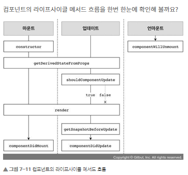

# 리액트 

- 리액트 이해

---
> ## 리액트의 이해
> 리액트는 자바스크립트 라이브러리로 사용자 인터페이스를 만드는 데 사용합니다. 구조가 MVC, MVW 등인 프레임워크와 달리, 오직 V(View)만 신경 쓰는 라이브러리.


> ## JSX란?
> 자바스크립트의 확장 문법
```JSX
function App() {
  return (
    <div>
      Hello <b>react</b>
    </div>
  );
}
▼▼▼▼▼▼▼▼▼▼▼▼▼▼▼▼▼▼▼▼▼▼▼▼▼▼▼▼▼▼▼▼▼▼▼▼▼▼▼▼▼▼▼▼▼▼▼▼▼▼▼▼▼▼▼▼▼▼▼▼▼▼▼▼
function App() {
return React.createElement("div", null, "Hello ", React.createElement("b", null, "react"));
}
```

> ## ReactDOM.render  
컴포넌트를 페이지에 렌더링하는 역할을 하며, react-dom 모듈을 불러와 사용

> ## 리액트_감싸주기
```js
import React from 'react';
function App() {
  return (
    <div> /**Fragment대체가능**/
      <h1>리액트 안녕!</h1>
      <h2>잘 작동하니?</h2>
    </div>
  );
}
export default App;
▼▼▼▼▼▼▼▼▼▼▼▼▼▼▼▼▼▼▼▼▼▼▼▼▼▼▼▼▼▼▼▼▼▼▼▼▼▼▼▼▼▼▼▼▼▼▼▼▼▼▼▼▼▼▼▼▼▼▼▼▼▼▼▼
import React from 'react';
function App() {
  return (
    <>
      <h1>리액트 안녕!</h1>
      <h2>잘 작동하니?</h2>
    </>
  );
}
export default App;
```
> ## 리액트_자바스크립트 표현
```js
import React from 'react';
function App() {
    const name = '리액트';
    return(
        <>
        <h1>{name} 안녕!</h1>
        <h2>잘 작동하니?</h2?>
        </>
    );
}
export default App;     

{/* 결과: 리액트 안녕!<br> 잘 작동하니?*/}

```
> ## if문 대신 조건부 연산자(삼항연산자)
```js
function App() {
  const name = '리액트';
  return (
    <div>
      {name === '리액트' ? (
        <h1>리액트입니다.</h1>
      ) : (
        <h2>리액트가 아닙니다.</h2>
      )}
    </div>
  );
}
```

> ## AND 연산자(&&)를 사용한 조건부 렌더링
>function App() {
  const name = '뤼왝트';
  return <div>{name === '리액트' ? 리액트입니다. : null}</div>;
}
=
function App() {
  const name = '뤼왝트';
  return <div>{name === '리액트' && 리액트입니다.}</div>;
}

> ## 인라인 스타일링
> 카멜표기법: background-color -> backgroundColor

> ## 클래스형 컴포넌트
> ## 함수형 컴포넌트

 > ## propTypes를 통한 props 검증
 >컴포넌트의 필수 props를 지정하거나 props의 타입(type)을 지정할 때는 propTypes를 사용합니다. 컴포넌트의 propTypes를 지정하는 방법은 defaultProp을 설정하는 것과 비슷합니다. 우선 propTypes를 사용하려면 코드 상단에 import 구문을 사용

> ## PropTypes 종류

>• array: 배열<br>
• arrayOf(다른 PropType): 특정 PropType으로 이루어진 배열을 의미합니다. 예를 들어 arrayOf(PropTypes.number)는 숫자로 이루어진 배열입니다.<br>
• bool: true 혹은 false 값<br>
• func: 함수<br>
• number: 숫자<br>
• object: 객체<br>
• string: 문자열<br>
• symbol: ES6의 Symbol<br>
• node: 렌더링할 수 있는 모든 것(숫자, 문자열, 혹은 JSX 코드. children도 node PropType입니다.)<br>
• instanceOf(클래스): 특정 클래스의 인스턴스(예: instanceOf(MyClass))<br>
• oneOf(['dog', 'cat']): 주어진 배열 요소 중 값 하나<br>
• oneOfType([React.PropTypes.string, PropTypes.number]): 주어진 배열 안의 종류 중 하나<br>
• objectOf(React.PropTypes.number): 객체의 모든 키 값이 인자로 주어진 PropType인 객체<br>
• shape({ name: PropTypes.string, num: PropTypes.number }): 주어진 스키마를 가진 객체<br>
• any: 아무 종류

```js
import React, { Component } from 'react';
import PropTypes from 'prop-types';
 
class MyComponent extends Component {
  static defaultProps = {
    name: '기본 이름'
  };
  static propTypes = {
    name: PropTypes.string,
    favoriteNumber: PropTypes.number.isRequired
  };
  render() {
    const { name, favoriteNumber, children } = this.props; // 비구조화 할당
    return (...);
  }
}
 
export default MyComponent;
```
> ## state
>state는 컴포넌트 내부에서 바뀔 수 있는 값을 의미

> ## 클래스형 컴포넌트가 지니고 있는 state

> ## 함수형 컴포넌트에서 useState라는 함수를 통해 사용하는 state
>const array = [1, 2];
const [one, two] = array;

> ###  props는 부모 컴포넌트가 설정하고, state는 컴포넌트 자체적으로 지닌 값으로 컴포넌트 내부에서 값을 업데이트
>props를 사용한다고 해서 값이 무조건 고정적이지는 않다. 부모 컴포넌트의 state를 자식 컴포넌트의 props로 전달하고, 자식 컴포넌트에서 특정 이벤트가 발생할 때 부모 컴포넌트의 메서드를 호출하면 props도 유동적으로 사용

># 이벤트리스너
><li>이벤트 이름은 카멜 표기법으로 작성_onClick/onKeyUp</li>
><li>이벤트에 실행할 자바스크립트 코드를 전달하는 것이 아니라, 함수 형태의 값을 전달</li>
><li>DOM 요소에만 이벤트를 설정

>## 이벤트 종류
>• Clipboard<br>
• Composition<br>
• Keyboard<br>
• Focus<br>
• Form<br>
• Mouse<br>
• Selection<br>
• Touch<br>
• UI<br>
• Wheel<br>
• Media<br>
• Image<br>
• Animation<br>
• Transition

>## onKeyPress 이벤트 핸들링

>## DOM을 꼭 사용해야 하는 상황
>state만으로 해결할 수 없는 상황
>- 특정 input에 포커스 주기
>- 스크롤 박스 조작하기
>- Canvas 요소에 그림 그리기 등
의 상황에서는 DOM에 직접적으로 접근해야 하는데, 이를 위해 바로 ref를 사용.

>## 콜백 함수를 통한 ref 설정
> ref를 달고자 하는 요소에 ref라는 콜백함수를 props로 전달, 이 콜백 함수는 ref값을 파라미터로 전달 받으며 그 함수 내부에서 파라미터로 받은 ref를 컴포넌트의 멤버 변수로 설정<br><br>
 <input ref={(ref) => {this.input=ref}} />

 >## 컴포넌트에 ref 달기
 ><MyComponent ref={(ref) => {this.myComponent=ref}}/>

 >## filter 함수
 > 인자에 분류하고 싶은 조건을 반환하는 함수를 넣어 주면 쉽게 분류<br>
const numbers = [1, 2, 3, 4, 5, 6];<br>
const biggerThanThree = numbers.filter(number => number > 3);   // 결과: [4, 5, 6]

> 상태 안에서 배열을 변형할 때는 배열에 직접 접근하여 수정하는 것이 아니라 concat, filter 등의 배열 내장 함수를 사용하여 새로운 배열을 만든 후 이를 새로운 상태로 설정

>### 마운트(mount): DOM이 생성되고 웹 브라우저상에 나타나는 것
>## 호출 메서드:)<br>
>컴포넌트 만들기 -> constructor -> getDerivedStateFromProps -> render -> componentDidMount

>• constructor: 컴포넌트를 새로 만들 때마다 호출되는 클래스 생성자 메서드입니다.<br>
• getDerivedStateFromProps: props에 있는 값을 state에 넣을 때 사용하는 메서드입니다.<br>
• render: 우리가 준비한 UI를 렌더링하는 메서드입니다.<br>
• componentDidMount: 컴포넌트가 웹 브라우저상에 나타난 후 호출하는 메서드입니다.

> ### render()메서드
>### constructor(props) {..}
>컴포넌트의 생성자 메서드로 컴포넌트를 만들 때 처음으로 실행. 
초기 state를 정할 수 있다.

>###  getDerivedStateFromProps 메서드
>props로 받아 온 값을 state에 동기화시키는 용도로 사용하며, 컴포넌트가 마운트될 때와 업데이트될 때 호출

>### componentDidMount 메서드
>컴포넌트를 만들고, 첫 렌더링을 다 마친 후 실행. 이 안에서 다른 자바스크립트 라이브러리 또는 프레임워크의 함수를 호출하거나 이벤트 등록, setTimeout, setInterval, 네트워크 요청 같은 비동기 작업을 처리.

>### shouldComponentUpdate 메서드
>props 또는 state를 변경했을 때, 리렌더링을 시작할지 여부를 지정하는 메서드
이 메서드에서는 반드시 true 값 또는 false 값을 반환<br>
컴포넌트를 만들 때 이 메서드를 따로 생성하지 않으면 기본적으로 true값 반환<br>
이 메서드가 false 값을 반환한다면 업데이트 과정은 중지.<br>
재 props와 state는 this.props와 this.state로 접근하고, 새로 설정될 props 또는 state는 nextProps와 nextState로 접근

>### getSnapshotBeforeUpdate 메서드
>업데이트하기 직전의 값을 참고할 일이 있을 때 활용<br>
>스크롤바 위치 유지<br>
getSnapshotBeforeUpdate(prevProps, prevState) { <br>
    if(prevState.array != = this.state.array) {<br>
    const { scrollTop, scrollHeight } = this.list<br>
      return { scrollTop, scrollHeight };<br>
    }<br>
}

>### componentDidUpdate 메서드
>componentDidUpdate(prevProps, prevState, snapshot) { ... } <br>
리렌더링 완료 후 실행. 업데이트가 끝난 직후이므로, DOM 관련 처리를 해도 무방<br>prevProps 또는 prevState를 사용하여 컴포넌트가 이전에 가졌던 데이터에 접근 가능. <br>
getSnapshotBeforeUpdate에서 반환한 값이 있다면 여기서 snapshot 값을 전달 받을 수 있다.

>### componentWillUnmount 메서드
>componentWillUnmount() { ... } <br>
이것은 컴포넌트를 DOM에서 제거할 때 실행.<br> componentDidMount에서 등록한 이벤트, 타이머, 직접 생성한 DOM이 있다면 여기서 제거 작업

>### componentDidCatch 메서드
>컴포넌트 도중에 에러가 발생했을 때 애플리케이션이 먹통이 되지 않고 오류 UI를 보여 줄 수 있게 함<br>
componentDidCatch(error, info) {  <br>
  this.setState({  <br>
    error: true  <br>
  });  <br>
  console.log({ error, info })  <br>
}<br>


>### list에 있는 Hooks
> useTitle<br>
useInput<br>
usePageLeave<br>
useClick <br>
useFadeIn<br>
useFullscreen<br>
useHover<br>
useNetwork<br>
useNotificatio<br>n
useScroll<br>
useTabs<br>
usePreventLeave<br>
useConfirm<br>
useAxios

>## useState
>const [value, setValue] = useState(0);

>##  useEffect
>리액트 컴포넌트가 렌더링될 때마다 특정 작업을 수행하도록 설정할 수 있는 Hook

>## 특정 값이 업데이트될 때만 실행하고 싶을 때
>componentDidUpdate(prevProps, prevState) {<br>
if (prevProps.value != = this.props.value) {<br>
  doSomething();<br>
}<br>
}<br>

>##  마운트될 때만 실행하고 싶을 때
>useEffect(() => {<br>
    console.log('마운트될 때만 실행됩니다.'); <br>
  }, []);

>## useReducer
> useState보다 더 다양한 컴포넌트 상황에 따라 다양한 상태를 다른 값으로 업데이트해 주고 싶을 때 사용하는 Hook

>## useCallback
>렌더링 성능을 최적화해야 하는 상황에서 사용. 이 Hook을 사용하면 이벤트 핸들러 함수를 필요할 때만 생성

>## Sass(Syntactically Awesome Style Sheets)
>(문법적으로 매우 멋진 스타일시트)는 CSS 전처리기로 복잡한 작업을 쉽게 할 수 있도록 해 주고, 스타일 코드의 재활용성을 높여 줄 뿐만 아니라 코드의 가독성을 높여서 유지 보수를 더욱 쉽게

>## CSS Module
>CSS Module은 CSS를 불러와서 사용할 때 클래스 이름을 고유한 값, 즉 [파일 이름]_[클래스 이름]__[해시값] 형태로 자동으로 만들어서 컴포넌트 스타일 클래스 이름이 중첩되는 현상을 방지해 주는 기술
>const name = '리액트';
// const message = '제 이름은 ' + name + '입니다.'
const message = `제 이름은 ${name}입니다.`;